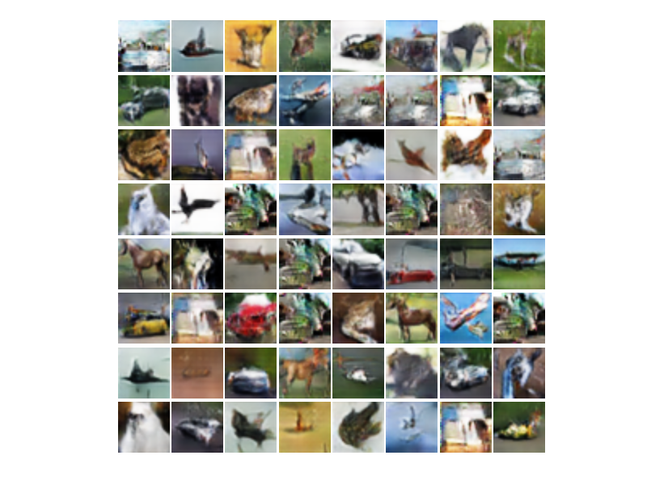
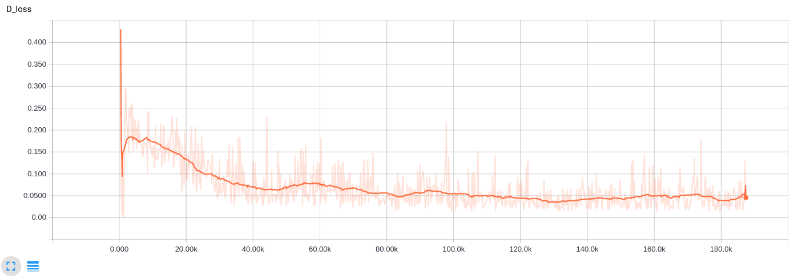
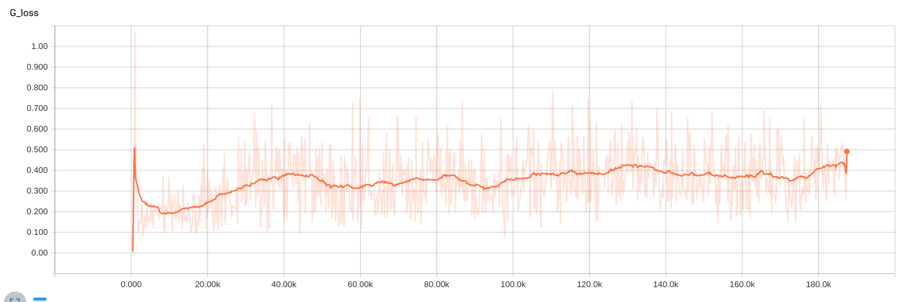

# LSGAN
[Least Square GAN](https://arxiv.org/abs/1611.04076v2) implemented by tensorflow   
## Environments
- Ubuntu 16.04
- GeForce GTX 1070
## Requirements
- python 2.7
- tensorflow 1.0
- matplotlib
## Results
- generated image

- discriminator loss

- generator loss

